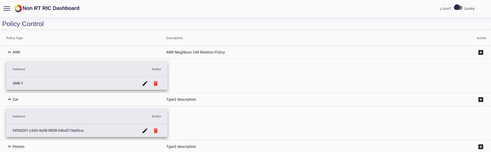

.. This work is licensed under a Creative Commons Attribution 4.0 International License.
.. http://creativecommons.org/licenses/by/4.0

API-Docs
========

This is the API-docs of Non-RT RIC.

.. contents::
   :depth: 3
   :local:

API Introduction
-----------------

The Non-RT RIC dashboard is an interface that allows human users to create, edit and delete policy instances, for each existing policy type. The policy types are owned by the Near-RT RIC, Non-RT RIC can just query them, so it's not possible to act on them.

API Functions
-------------

To run the dashboard locally, you can follow these steps:

- Fetch the latest code from `gerrit`_

.. _gerrit: https://gerrit.nordix.org/c/oransc/nonrtric/+/2747/

- Before compiling, run the following commands::

    git submodule init

    git submodule update

- Start the backend (you might have to build it first)::

    mvn clean install

    mvn -Dorg.oransc.ric.portal.dashboard=mock -Dtest=DashboardTestServer -DfailIfNoTests=false test

- Now you can open URL:  `localhost:8080`_ in a browser. 

.. _localhost:8080: localhost:8080

From the main page, click on the "Policy Control" card. From here, it is possible to create or list instances for each existing policy type.

When the instances are listed, it is possible to edit or delete each instance from the expanded view.

