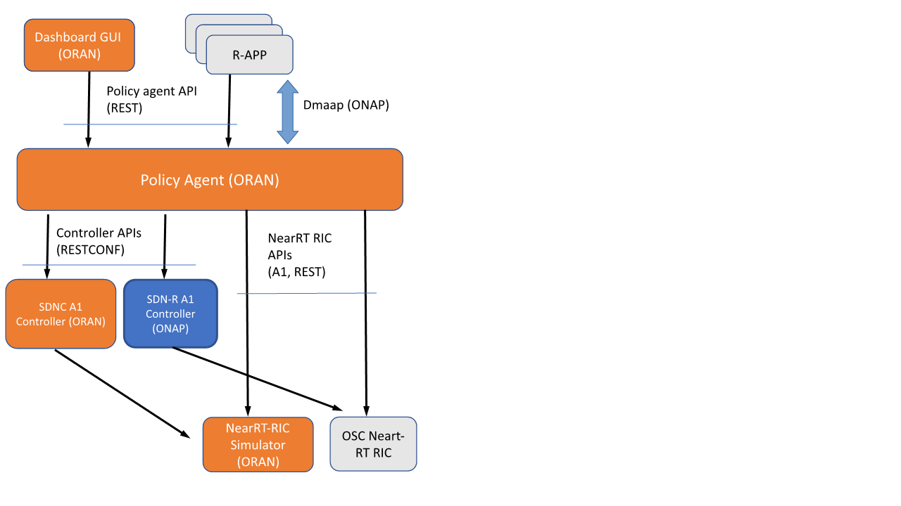

.. This work is licensed under a Creative Commons Attribution 4.0 International License.
.. SPDX-License-Identifier: CC-BY-4.0
.. Copyright (C) 2020 Nordix

Requirements for the Non-RT RIC project
==========================================

Find detailed description of what Non-RT RIC is on this `page`_.

.. _page: https://wiki.o-ran-sc.org/display/RICNR/

There are functional requirements emitted by O-RAN WG2 for the Non-RT RIC, which are the following:

#. Non-RT RIC shall support data retrieval and analysis; the data may include performance, configuration or other data related to the application (recommended data shown in required data section for  different use cases).
#. Non-RT RIC shall support relevant AI/ML model training based on the data in 1. for non-real-time optimization of configuration parameters in RAN or Near-RT RIC, as applicable for the use case.
#. Non-RT RIC shall support relevant AI/ML model training based on the data in 1. for generating/optimizing policies and intents to guide the behavior of applications in Near-RT RIC or RAN, as applicable for the use case.
#. Non-RT RIC shall support training of relevant AI/ML models based on the data in 1. to be deployed/updated in Near-RT RIC as required by the applications.
#. Non-RT RIC shall support performance monitoring and evaluation.
#. Non-RT RIC shall support a fallback mechanism to prevent drastic degradation/fluctuation of performance, e.g. to restore to the previous policy or configuration.

The non-functional requirements are the following ones:

#. Non-RT RIC shall not update the same policy or configuration parameter for a given Near-RT RIC or RAN function more often than once per second.
#. Non-RT RIC shall be able to update policies in several Near-RT RICs.

Moreover, there are functional requirements regarding the A1 interface:

#. A1 interface shall support communication of policies/intents from Non-RT RIC to Near-RT RIC.
#. A1 interface shall support AI/ML model deployment and update from Non-RT RIC to Near-RT RIC.
#. A1 interface shall support communication of enrichment information from Non-RT RIC to Near-RT RIC.
#. A1 interface shall support feedback from Near-RT RIC for monitoring AI/ML model performance.
#. A1 interface shall support the policy/intents feedback from Near-RT RIC to Non-RT RIC.

A1 policy procedure
-------------------

As for A-release, the methods are as follows:

+---------------------+--------------------------+--------------------------+
| A1 policy procedure | Single policy method     | Multiple policies method |
+---------------------+--------------------------+--------------------------+
| Create policy       | PUT                      |                          |
+---------------------+--------------------------+--------------------------+
| Query policy        | GET                      | GET (sequence of \*)     |
+---------------------+--------------------------+--------------------------+
| Update policy       | PUT                      |                          |
+---------------------+--------------------------+--------------------------+
| Delete policy       | DELETE                   |                          |
+---------------------+--------------------------+--------------------------+
| Notify policy       | POST                     | POST                     |
+---------------------+--------------------------+--------------------------+

Policy Agent Overview
=======================

The Policy Agent maintains a transient repository of the following items to support R-Apps:

 * All Near-RT RICs in the network. This information is configured using the ONAP CDS database (which is using the Cloudify Consul database).
 * All Policy types for all Near-RT RICs
 * All configured Policy instances in the network

It provides an NBI for the R-Apps (and for the Control Panel) for policy management. This is a REST API.
As an option, policy management can also be done via asynchronous messages through ONAP/Dmaap.
The NBI provides support for an R-APP to locate the correct Near-RT RIC based on identifiers as defined in O1.

The agent monitors all Near-RT RICs and recovers from data inconsistencies, which may happen when (for instance) an Near-RT RIC restarts.

The R-Apps can be monitored so that their Policies can be automatically removed when an R-App is stopped/removed.

On its southbound side the agent can connect to a number of different A1 providers:

 * Directly to the Non-RT RIC:

      - OSC API, which is influenced by the A1 standard
      - The Non-RT RIC simulator, which supports the A1 standard with a number of not yet CRs included.
 * To an ONAP style controller.

Amber release Policy Agent architecture
-----------------------------------------

Non-RT RIC components:

 #. Policy Agent
 #. SDNC A1 Controller

