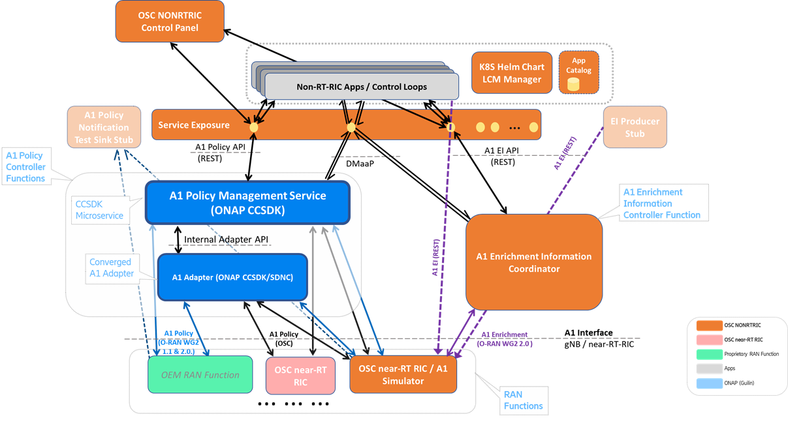

.. This work is licensed under a Creative Commons Attribution 4.0 International License.
.. SPDX-License-Identifier: CC-BY-4.0
.. Copyright (C) 2020 Nordix

Summary
-------

The Non-RealTime RIC (RAN Intelligent Controller) is an Orchestration and Automation function described by the O-RAN Alliance for non-real-time intelligent management of RAN (Radio Access Network) functions. The primary goal of the Non-RealTime RIC is to support non-real-time radio resource management, higher layer procedure optimization, policy optimization in RAN, and providing guidance, parameters, policies and AI/ML models to support the operation of near-RealTime RIC functions in the RAN to achieve higher-level non-real-time objectives. NONRTRIC functions include service and policy management, RAN analytics and model-training for the near-RealTime RICs. The NONRTRIC project provides concepts, specifications, architecture and reference implementations as defined and described by the `O-RAN Alliance <https://www.o-ran.org>`_ architecture.

The O-RAN-SC NONRTRIC implementation communicates with near-RealTime RIC elements in the RAN via the A1 interface. Using the A1 interface the NONRTRIC will facilitate the provision of policies for individual UEs or groups of UEs; monitor and provide basic feedback on policy state from near-RealTime RICs; provide enrichment information as required by near-RealTime RICs; and facilitate ML model training, distribution and inference in cooperation with the near-RealTime RICs.

|archpic|

Find detailed description of the NONRTRIC project see the `O-RAN SC NONRTRIC Project Wiki <https://wiki.o-ran-sc.org/display/RICNR/>`_.

NONRTRIC components
-------------------

These are the components that make up the Non-RT-RIC:

* Non-RT-RIC Control Panel / Dashboard
* A1 Policy Management Service (developed in ONAP)
* A1/SDNC Controller & A1 Adapter (Controller plugin)
* Enrichment Information Coordinator
* Non-RT-RIC (Spring Cloud) Service Gateway
* Non-RT-RIC (Kong) Service Exposure Prototyping
* Initial Non-RT-RIC App Catalogue
* Near-RT-RIC A1 Simulator

The code base for "D" Release is in the `NONRTRIC <https://gerrit.o-ran-sc.org/r/admin/repos/nonrtric>`_, `NONRTRIC-ControlPanel <https://gerrit.o-ran-sc.org/r/admin/repos/portal/nonrtric-controlpanel>`_, and `Near-RT-RIC A1-Simulator <https://gerrit.o-ran-sc.org/r/admin/repos/sim/a1-interface>`_ , Gerrit source repositories (D Branch).

Non-RT-RIC Control Panel / NONRTRIC Dashboard
~~~~~~~~~~~~~~~~~~~~~~~~~~~~~~~~~~~~~~~~~~~~~

Graphical user interface

* View and Manage A1 policies in the RAN (near-RT-RICs)
* Interacts with the Policy agent’s NBI (REST API)
* Graphical A1 policy creation/editing is model-driven, based on policy type’s JSON schema
* View and manage producers and jobs for the Enrichment coordinator service
* Configure A1 Policy Management Service (e.g. add/remove near-rt-rics)
* Interacts with the A1-PolicyManagementService & A1-EI-Coordinator (REST NBIs) via Service Exposure gateway
     
Implementation:

* Frontend: Angular framework
* Repo: *portal/nonrtric-controlpanel*

Please refer the developer guide and the wiki to set up in your local environment.

More details available at the `NONRTRIC-Portal documentation site <https://docs.o-ran-sc.org/projects/o-ran-sc-portal-nonrtric-controlpanel>`_

A1 Policy Management Service (from ONAP CCSDK)
~~~~~~~~~~~~~~~~~~~~~~~~~~~~~~~~~~~~~~~~~~~~~~

A1 Controller Service above A1 Controller/Adaptor that provides:

* Unified REST & DMaaP NBI APIs for managing A1 Policies in all near-RT-RICs

  + Query A1 Policy Types in near-RT-RICs
  + Create/Query/Update/Delete A1 Policy Instances in near-RT-RICs
  + Query Status for A1 Policy Instances

* Maintains (persistent) cache of RAN’s A1 Policy information

  * Support RAN-wide view of A1 Policy information
  * Streamline A1 traffic
  * Enable (optional) re-synchronization after inconsistencies / near-RT-RIC restarts
  * Supports a large number of near-RT-RICs (& multi-version support)
  
* Converged ONAP & O-RAN-SC A1 Adapter/Controller functions in ONAP SDNC/CCSDK (Optionally deploy without A1 Adaptor to connect direct to near-RT-RICs)
* Support for different Southbound connectors per near-RT-RIC - e.g. different A1 versions, different near-RT-RIC version, different A1 adapter/controllers supports different or proprietary A1 controllers/EMSs

See also: `A1 Policy Management Service in ONAP <https://wiki.onap.org/pages/viewpage.action?pageId=84672221>`_  

A1/SDNC Controller & A1 Adapter (Controller plugin)
~~~~~~~~~~~~~~~~~~~~~~~~~~~~~~~~~~~~~~~~~~~~~~~~~~~
Mediation point for A1 interface termination in SMO/NONRTRIC

* Implemented as CCSDK OSGI Feature/Bundles
* A1 REST southbound
* RESTCONF Northbound
* NETCONF YANG > RESTCONF adapter
* SLI Mapping logic supported
* Can be included in an any controller based on ONAP CCSDK
* Continues to support both a dedicated OSC A1-controller persona and an ONAP SDNC persona  

See also: `A1 Adapter/Controller Functions in ONAP <https://wiki.onap.org/pages/viewpage.action?pageId=84672221>`_  
  
Enrichment Information Job Coordination Service
~~~~~~~~~~~~~~~~~~~~~~~~~~~~~~~~~~~~~~~~~~~~~~~

Coordinate/Register A1-EI Types, Producers, Consumers, and Jobs.

* Maintains a registry of:

  - A1-EI Data Types / schemas
  - A1-EI Producers
  - A1-EI Consumers
  - A1-EI Jobs

* A1-EI Query API (e.g. per producer, per consumer, per types)
* Query status of A1-EI jobs
* Monitors all near-RT-RICs and recovers from inconsistencies
* After EI-type/Producer/Consumer/Job is successfully registered delivery/flow can happen directly between A1-EI Producers (in SMO/NONRTRIC domain) and A1-EI consumers (near-RT-RICs in RAN domain)
* *Being extended to coordinate non-A1 Enrichment Information exchange between NONRTRIC Apps*

Non-RT-RIC (Spring Cloud) Service Gateway
~~~~~~~~~~~~~~~~~~~~~~~~~~~~~~~~~~~~~~~~~
Support Apps to use A1 Services 

* `Spring Cloud Gateway <https://cloud.spring.io/spring-cloud-gateway>`_ provides the library to build a basic API gateway
* Exposes A1 Policy Management Service & Enrichment Coordinator Service.  
* Additional predicates can be added in code or preferably in the Gateway yaml configuration.

Implementation:

* Implemented as a Java Spring Cloud application
* Repo: *portal/nonrtric-controlpanel*

Non-RT-RIC (Kong) Service Exposure Prototyping
~~~~~~~~~~~~~~~~~~~~~~~~~~~~~~~~~~~~~~~~~~~~~~

Support Apps to use NONRTRIC, SMO and other App interfaces
A building block for coming releases as the R1 Interface concept matures 

* Support dynamic registration and exposure of service interfaces to Non-RT-RIC applications (& NONRTRIC Control panel)
* Extends a static gateway function specifically for NONRTRIC Control panel (described above)
* Initial version based on `Kong API Gateway <https://docs.konghq.com/gateway-oss>`_ function
* Initial exposure candidates include A1 (NONRTRIC) services & O1 (OAM/SMO) services

NONRTRIC Kubernetes deployment - including Kong configurations can be found in the OSC `it/dep <https://gerrit.o-ran-sc.org/r/gitweb?p=it/dep.git;a=tree;f=nonrtric/helm;hb=refs/heads/master>`_ Gerrit repo. 

Initial Non-RT-RIC App Catalogue
~~~~~~~~~~~~~~~~~~~~~~~~~~~~~~~~

Register for Non-RT-RIC Apps.

* Non-RT-RIC Apps can be registered / queried
* Limited functionality/integration for now
* *More work required in coming releases as the rApp concept matures*

Initial K8S Helm Chart LCM Manager
~~~~~~~~~~~~~~~~~~~~~~~~~~~~~~~~~~

Onboard, start, stop, and modify Non-RT-RIC App µServices as Helm Charts
*A building block for coming releases as the R-APP concept matures*

* Interfaces that accepts Non-RT-RIC App µServices Helm Charts
* Support basic LCM operations
* Onboard, Start, Stop, Modify, Monitor
* Initial version co-developed with v. similar functions in ONAP
* *Limited functionality/integration for now*

A1 Interface / Near-RT-RIC Simulator
~~~~~~~~~~~~~~~~~~~~~~~~~~~~~~~~~~~~

Stateful A1 test stub.

* Used to create multiple stateful A1 providers (simulated near-rt-rics)
* Supports A1-Policy and A1-EnrichmentInformation
* Swagger-based northbound interface, so easy to change the A1 profile exposed (e.g. A1 version, A1 Policy Types, A1-E1 consumers, etc)
* All A1-AP versions supported

Implementation:

* Implemented as a Python application
* Repo: *sim/a1-interface*

More details available at the `A1 Simulator documentation site <https://docs.o-ran-sc.org/projects/o-ran-sc-sim-a1-interface>`_
