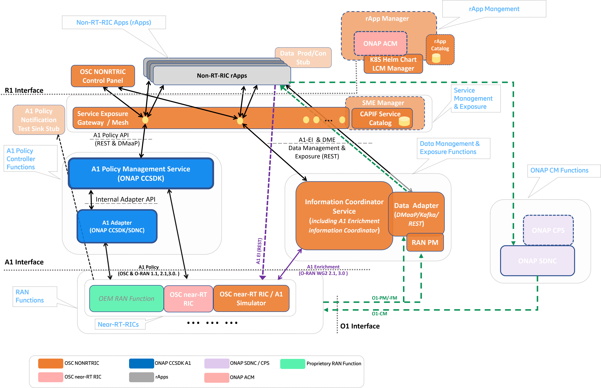
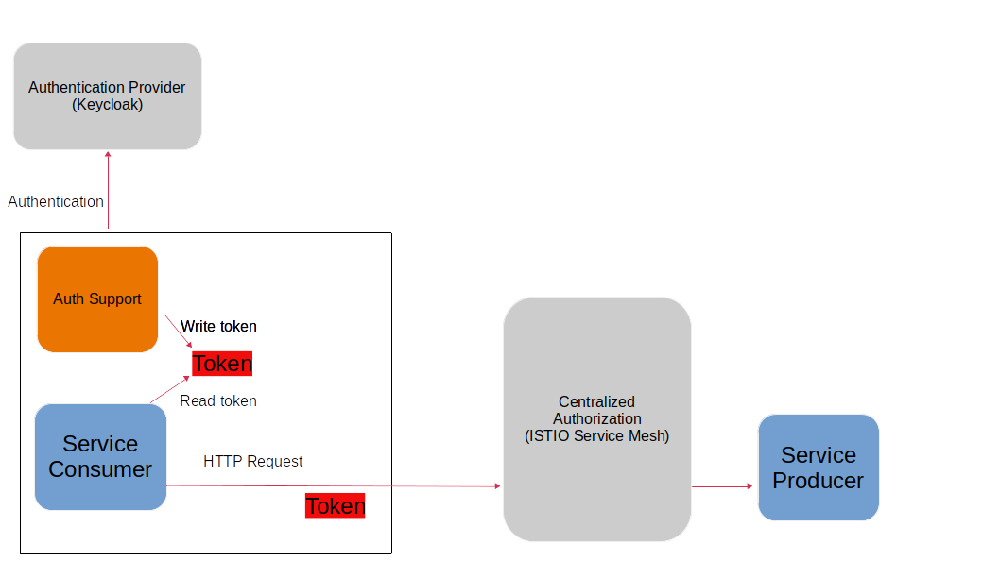

.. This work is licensed under a Creative Commons Attribution 4.0 International License.
.. SPDX-License-Identifier: CC-BY-4.0
.. Copyright (C) 2021-2023 Nordix Foundation. All rights Reserved
.. Copyright (C) 2023 OpenInfra Foundation Europe. All Rights Reserved

Summary
-------

The Non-RealTime RIC (RAN Intelligent Controller) is an Orchestration and Automation function described by the O-RAN Alliance for non-real-time intelligent management of RAN (Radio Access Network) functions.

The primary goal of the Non-RealTime RIC is to support non-real-time radio resource management, higher layer procedure optimization, policy optimization in RAN, and providing guidance, parameters, policies and AI/ML models to support the operation of near-RealTime RIC functions in the RAN to achieve higher-level non-real-time objectives.

Non-RealTime RIC functions include service and policy management and RAN analytics for the RAN.
The Non-RealTime RIC platform hosts and coordinates rApps (Non-RT RIC applications) to perform Non-RealTime RIC tasks.
The Non-RealTime RIC also hosts the new R1 interface (between rApps and SMO/Non-RealTime-RIC services).

The O-RAN-SC (OSC) NONRTRIC project provides concepts, architecture and reference implementations as defined and described by the `O-RAN Alliance <https://www.o-ran.org>`_ architecture.
The OSC NONRTRIC implementation communicates with near-RealTime RIC elements in the RAN via the A1 interface. Using the A1 interface the NONRTRIC will facilitate the provision of policies for individual UEs or groups of UEs; monitor and provide basic feedback on policy state from near-RealTime RICs; provide enrichment information as required by near-RealTime RICs; and facilitate ML model training, distribution and inference in cooperation with the near-RealTime RICs.
The OSC NONRTRIC hosts rApps, and coordinates all interactions between the rApp and underlying SMo by way of the R1 Interface. 

|archpic|

Find detailed description of the NONRTRIC project see the `O-RAN SC NONRTRIC Project Wiki <nonrtricwiki_>`_.

NONRTRIC components
-------------------

These are the components that make up the Non-RT-RIC:

* `Non-RT-RIC Control Panel <#non-rt-ric-control-panel-nonrtric-dashboard>`_.  (:doc:`Documentation site <controlpanel:index>`).
* `Information Coordinator Service <#information-coordination-service>`_.  (:doc:`Documentation site <informationcoordinatorservice:index>`).
* `A1 Policy Management Service <#a1-policy-management-service-from-onap-ccsdk>`_.  (:doc:`Documentation site <a1policymanagementservice:index>`).
* `A1 Policy Controller / Adapter <#a1-sdnc-controller-a1-adapter-controller-plugin>`_.
* `Near-RT RIC A1 Simulator <#a1-interface-near-rt-ric-simulator>`_.  (:doc:`Documentation site <simulator:index>`).
* `Non-RT-RIC (Spring Cloud) Service Gateway <#spring-cloud-service-gateway>`_.
* `Non-RT-RIC Service Exposure Security Architecture Prototyping <#service-exposure-security-architecture-prototyping>`_.  (:doc:`Documentation site <service-exposure/se-overview/>`). 
* `DMaaP/Kafka Information Producer Adapters <#dmaap-information-producer-adapters-kafka>`_.  (:doc:`Documentation site adapter <dmaapadapter:index>`),  (:doc:`Documentation site mediator <dmaapmediatorproducer:index>`).
* `Initial Non-RT-RIC App Catalogue <#initial-app-catalogue>`_.  (:doc:`Documentation site <rappcatalogue:index>`).
* `Initial K8S Helm Chart LCM Manager <#initial-kubernetes-helm-chart-lcm-manager>`_.  (:doc:`Documentation site <helmmanager:index>`).
* `Service Management & Exposure (SME) (CAPIF) <#service-management-and-exposure-capif>`_.  (:doc:`Documentation site <sme:index>`).
* `Authentication Support <#authentication-support-keycloak>`_.
* `RApp Manager Service <#rapp-manager-service>`__.  (:doc:`Documentation site <rappmanager:index>`).
* `RAN Performance Monitoring Functions (File-based PM) <#ran-performance-monitoring-functions-file-based-pm>`__   (:doc:`Documentation site <ranpm:index>`).
* `Test Framework <#non-rt-ric-test-framework>`_.
* `Use Cases: <#non-rt-ric-use-cases>`_

  * "Helloworld" O-RU Fronthaul Recovery use case.  (:doc:`Documentation site <orufhrecovery:index>`).
  * "Helloworld" O-DU Slice Assurance use case.  (:doc:`Documentation site <ransliceassurance:index>`).

Non-RT-RIC Control Panel / NONRTRIC Dashboard
~~~~~~~~~~~~~~~~~~~~~~~~~~~~~~~~~~~~~~~~~~~~~

Graphical user interface.

- View and Manage A1 policies in the RAN (near-RT-RICs)
- Graphical A1 policy creation/editing is model-driven, based on policy type's JSON schema
- View and manage producers and jobs for the Information coordinator service
- Configure A1 Policy Management Service (e.g. add/remove near-rt-rics)
- Interacts with the A1-Policy Management Service & Information Coordination Service (REST NBIs) via Service Exposure gateway

Implementation:

- Frontend: Angular framework
- Repo: *portal/nonrtric-controlpanel*
- Documentation at the :doc:`NONRTRIC-Portal documentation site <controlpanel:index>`.

Information Coordination Service
~~~~~~~~~~~~~~~~~~~~~~~~~~~~~~~~

The ICS is a data subscription service which decouples data producers from data consumers. A data consumer can create a data subscription (Information Job) without any knowledge of its data producers (one subscription may involve several data producers). A data producer has the ability to produce one or several types of data (Information Type). One type of data can be produced by zero to many producers.

A data consumer can have several active data subscriptions (Information Job). One Information Job consists of the type of data to produce and additional parameters, which may be different for different data types. These parameters are not defined or limited by this service.

Maintains a registry of:

- Information Types / schemas
- Information Producers
- Information Consumers
- Information Jobs

The service is not involved in data delivery and hence does not put restrictions on this.

Implementation:

- Implemented as a Java Spring Boot application.
- Repo: *nonrtric/plt/informationcoordinatorservice*.
- Documentation at the :doc:`Information Coordination Service site <informationcoordinatorservice:index>`.

A1 Policy Management Service (from ONAP CCSDK)
~~~~~~~~~~~~~~~~~~~~~~~~~~~~~~~~~~~~~~~~~~~~~~

A1 Controller Service above A1 Controller/Adapter that provides:

- Unified REST & DMaaP NBI APIs for managing A1 Policies in all near-RT-RICs.

  - Query A1 Policy Types in near-RT-RICs.
  - Create/Query/Update/Delete A1 Policy Instances in near-RT-RICs.
  - Query Status for A1 Policy Instances.

Maintains (persistent) cache of RAN's A1 Policy information.

- Support RAN-wide view of A1 Policy information.
- Streamline A1 traffic.
- Enable (optional) re-synchronization after inconsistencies / near-RT-RIC restarts.
- Supports a large number of near-RT-RICs (& multi-version support).

- Converged ONAP & O-RAN-SC A1 Adapter/Controller functions in ONAP SDNC/CCSDK (Optionally deploy without A1 Adapter to connect direct to near-RT-RICs).
- Support for different Southbound connectors per near-RT-RIC - e.g. different A1 versions, different near-RT-RIC version, different A1 adapter/controllers supports different or proprietary A1 controllers/EMSs.

Implementation:

- Implemented as a Java Spring Boot application.
- Wiki: `A1 Policy Management Service in ONAP <https://lf-onap.atlassian.net/wiki/spaces/DW/pages/16444961/O-RAN+A1+Policies+in+ONAP>`_ .
- Repo: *nonrtric/plt/a1policymanagementservice*.
- Documentation at the :doc:`A1 Policy Management Service documentation site <a1policymanagementservice:index>`.

A1/SDNC Controller & A1 Adapter (Controller plugin)
~~~~~~~~~~~~~~~~~~~~~~~~~~~~~~~~~~~~~~~~~~~~~~~~~~~

Mediation point for A1 interface termination in SMO/NONRTRIC.

- Implemented as CCSDK OSGI Feature/Bundles.
- A1 REST southbound.
- RESTCONF Northbound.
- NETCONF YANG > RESTCONF adapter.
- SLI Mapping logic supported.
- Can be included in an any controller based on ONAP CCSDK.

Implementation:

- Repo: *nonrtric/plt/sdnca1controller*
- Wiki: `A1 Adapter/Controller Functions in ONAP <https://lf-onap.atlassian.net/wiki/spaces/DW/pages/16444961/O-RAN+A1+Policies+in+ONAP>`_ .

A1 Interface / Near-RT-RIC Simulator
~~~~~~~~~~~~~~~~~~~~~~~~~~~~~~~~~~~~

Stateful A1 test stub.

- Used to create multiple stateful A1 providers (simulated near-rt-rics).
- Supports A1-Policy and A1-Enrichment Information.
- Swagger-based northbound interface, so easy to change the A1 profile exposed (e.g. A1 version, A1 Policy Types, A1-E1 consumers, etc).
- All A1-AP versions supported.

Implementation:

- Implemented as a Python application.
- Repo: *sim/a1-interface*.
- Documentation at the :doc:`A1 Simulator documentation site <simulator:index>`.

(Spring Cloud) Service Gateway
~~~~~~~~~~~~~~~~~~~~~~~~~~~~~~
Support Apps to use A1 Services.

- `Spring Cloud Gateway <https://cloud.spring.io/spring-cloud-gateway>`_ provides the library to build a basic API gateway.
- Exposes A1 Policy Management Service & Information Coordinator Service.
- Additional predicates can be added in code or preferably in the Gateway yaml configuration.

Implementation:

- Implemented as a Java Spring Cloud application.
- Repo: *portal/nonrtric-controlpanel*.

Service Exposure Security Architecture Prototyping
~~~~~~~~~~~~~~~~~~~~~~~~~~~~~~~~~~~~~~~~~~~~~~~~~~

Support Apps to use NONRTRIC, SMO and other App interfaces.
A building block for coming releases as the R1 Interface concept matures .

- Support dynamic registration and exposure of service interfaces to Non-RT-RIC applications (& NONRTRIC Control panel).
- The architecture and components are defined in :doc:`Non-RT RIC Security Architecture Prototyping (Documentation site) <service-exposure/se-overview/>`. 
- Works with the CAPIF `Service Management & Exposure (SME) <#service-management-and-exposure>`_. :doc:`Documentation site <sme:index>` functions.

DMaaP Information Producer Adapters (Kafka)
~~~~~~~~~~~~~~~~~~~~~~~~~~~~~~~~~~~~~~~~~~~

Configurable mediators to take information from DMaaP and Kafka and present it as a coordinated Information Producer.

These mediators/adapters are generic information producers, which register themselves as information producers of defined information types in Information Coordination Service (ICS).
The information types are defined in a configuration file.
Information jobs defined using ICS then allow information consumers to retrieve data from DMaaP MR or Kafka topics (accessing the ICS API).

There are two alternative implementations to allow Information Consumers to consume DMaaP or Kafka events as coordinated Information Jobs.

Implementation:

- Implementation in Java Spring (DMaaP Adapter), repo: *nonrtric/plt/dmaapadapter*, see :doc:`DMaaP Adapter documentation site <dmaapadapter:index>`.
- Implementation in Go (DMaaP Mediator Producer), repo: *nonrtric/plt/dmaapmediatorproducer*, see :doc:`DMaaP Mediator Producer documentation site <dmaapmediatorproducer:index>`.

Initial App Catalogue
~~~~~~~~~~~~~~~~~~~~~

Register for Non-RT-RIC Apps.

- Non-RT-RIC Apps can be registered / queried.
- Limited functionality/integration for now.
- *More work required in coming releases as the rApp concept matures*.

Implementation:

- Implemented as a Java Spring Boot application and in Python.
- Repo: *nonrtric/plt/rappcatalogue*
- Documentation at the :doc:`rApp Catalogue documentation site <rappcatalogue:index>`.

Initial Kubernetes Helm Chart LCM Manager
~~~~~~~~~~~~~~~~~~~~~~~~~~~~~~~~~~~~~~~~~

Onboard, start, stop, and modify Non-RT-RIC App µServices as Helm Charts.
*A building block for coming releases as the R-APP concept matures*.

- Interfaces that accepts Non-RT-RIC App µServices Helm Charts.
- Support basic LCM operations.
- Onboard, Start, Stop, Modify, Monitor.
- Initial version co-developed with v. similar functions in ONAP.
- *Limited functionality/integration for now*.

Implementation:

- Implemented as a Java Spring Boot application.
- Repo: *nonrtric/plt/helmmanager*
- Documentation at the :doc:`Helm Manager documentation site <helmmanager:index>`.

Service Management and Exposure (CAPIF)
~~~~~~~~~~~~~~~~~~~~~~~~~~~~~~~~~~~~~~~

An initial implementation of the CAPIF Core service. It implements the following CAPIF APIs:

- API Provider Management
- Publish Service
- Discover Service
- API Invoker Management
- Security
- Events

Implementation:

- Implemented in Go
- Repo: *nonrtric/plt/sme*
- Documentation at the :doc:`Service Management & Exposure (SME) documentation site <sme:index>`.

Authentication Support (Keycloak)
~~~~~~~~~~~~~~~~~~~~~~~~~~~~~~~~~

The auth-token-fetch provides support for authentication.
It is intended to be used as a sidecar and does the authentication procedure, gets and saves the access token
in the local file system. This includes refresh of the token before it expires.
This means that the service only needs to read the token from a file.

It is tested using Keycloak as authentication provider.

So, a service just needs to read the token file and for instance insert it in the authorization header when using HTTP.
The file needs to be re-read if it has been updated.

The auth-token-fetch is configured by the following environment variables.

* CERT_PATH - the file path of the cert to use for TSL, example: security/tls.crt
* CERT_KEY_PATH - the file path of the private key file for the cert, example: "security/tls.key"
* ROOT_CA_CERTS_PATH - the file path of the trust store.
* CREDS_GRANT_TYPE - the grant_type used for authentication, example: client_credentials
* CREDS_CLIENT_SECRET - the secret/private shared key used for authentication
* CREDS_CLIENT_ID - the client id used for authentication
* OUTPUT_FILE - the path where the fetched authorization token is stored, example: "/tmp/authToken.txt"
* AUTH_SERVICE_URL - the URL to the authentication service (Keycloak)
* REFRESH_MARGIN_SECONDS - how long in advance before the authorization token expires it is refreshed

RApp Manager Service
~~~~~~~~~~~~~~~~~~~~

Early version of a service to manage rApps and rApp instances. 

- Manages the entire lifecycle and state of rApp and thie instances
- Integrated with NONRTRIC Data Management & Exposure functions (ICS)
- Integrates with NONRTRIC Service registration and discovery functions (SME CAPIF)
- Also add new ONAP ACM participants to handle rApp composition elements

Implementation:

- Implemented as a Java Spring Boot application.
- Repo: *nonrtric/plt/rappmanager*
- Documentation at the :doc:`Non-RT RIC rApp Manager documentation site <rappmanager:index>`.

RAN Performance Monitoring Functions (File-based PM)
~~~~~~~~~~~~~~~~~~~~~~~~~~~~~~~~~~~~~~~~~~~~~~~~~~~~

Functions to collect/parse/filter/store/forward file-based & event-based RAN PM data:

- End-to-end tool-chain to collection, parsing, filtering and delivery of file-based RAN PM observability data
- PM report data format defined by 3GPP (TS 32.432 and 3GPP TS 32.435)
- High performance, fully scalable
- Subscribers (e.g. rApps) can subscribe for chosen measurement types from specific resources in the network

Implementation:

- Implemented in Go, Java and Python
- Repo: *nonrtric/plt/ranpm*
- Documentation at the :doc:`Non-RT RIC RAN PM Usecase / Functions documentation site <ranpm:index>`.

Non-RT-RIC Test Framework
~~~~~~~~~~~~~~~~~~~~~~~~~

A full test environment with extensive test cases/scripts can be found in the ``test`` directory in the *nonrtric* source code.

Non-RT-RIC Use Cases
~~~~~~~~~~~~~~~~~~~~

"Helloworld" O-RU Fronthaul Recovery use case
^^^^^^^^^^^^^^^^^^^^^^^^^^^^^^^^^^^^^^^^^^^^^

A very simplified closed-loop rApp use case to re-establish front-haul connections between O-DUs and O-RUs if they fail. Not intended to to be 'real-world'.

Implementation:

- One version implemented in Python, one in Go as an Information Coordination Service Consumer, and one as an apex policy.
- Repo: *nonrtric/rapp/orufhrecovery*
- Documentation at the :doc:`O-RU Fronthaul Recovery documentation site <orufhrecovery:index>`.

"Helloworld" O-DU Slice Assurance use case
^^^^^^^^^^^^^^^^^^^^^^^^^^^^^^^^^^^^^^^^^^

A very simplified closed-loop rApp use case to re-prioritize a RAN slice's radio resource allocation priority if sufficient throughput cannot be maintained. Not intended to to be 'real-world'.

Implementation:

- One version implemented in Go as a micro service, one in Go as an Information Coordination Service Consumer.
- Repo: *nonrtric/rapp/ransliceassurance*
- Documentation at the :doc:`O-DU Slice Assurance documentation site <ransliceassurance:index>`.
