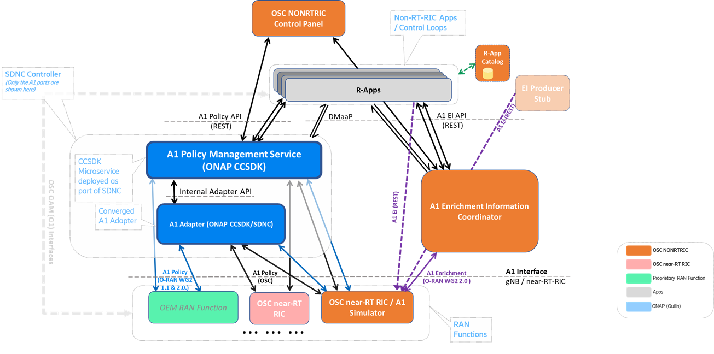

.. This work is licensed under a Creative Commons Attribution 4.0 International License.
.. SPDX-License-Identifier: CC-BY-4.0
.. Copyright (C) 2021 Nordix

O-RAN SC Non-RT RIC project
===========================

Summary
-------

A Non-RealTime RIC (RAN Intelligent Controller) is an Orchestration and Automation function described by the O-RAN Alliance for non-real-time intelligent management of RAN (Radio Access Network) functions. The primary goal of the NONRTRIC is to support non-real-time radio resource management, higher layer procedure optimization, policy optimization in RAN, and providing guidance, parameters, policies and AI/ML models to support the operation of near-RealTime RIC functions in the RAN to achieve higher-level non-real-time objectives. NONRTRIC functions include service and policy management, RAN analytics and model-training for the near-RealTime RICs. The non-RealTime RIC project provides concepts, specifications, architecture and reference implementations as defined and described by the `O-RAN Alliance <https://www.o-ran.org>`_ architecture.

The NONRTRIC implementation communicates with near-RealTime RIC elements in the RAN via the A1 interface. Using the A1 interface the NONRTRIC will facilitate the provision of policies for individual UEs or groups of UEs; monitor and provide basic feedback on policy state from near-RealTime RICs; provide enrichment information as required by near-RealTime RICs; and facilitate ML model training, distribution and inference in cooperation with the near-RealTime RICs.

|archpic|

Find detailed description of what Non-RT RIC is on the `O-RAN SC NONRTRIC Project Wiki <https://wiki.o-ran-sc.org/display/RICNR/>`_.

NONRTRIC components
-------------------

 * Non-RT RIC Control Panel / Dashboard
 * A1 Policy Management Service (developed in ONAP)
 * Enrichment Information Coordinator
 * R-App Catalogue
 * A1 Controller - based on ONAP SDNC
 * An A1 Simulator - simualtes the A1 aspects of a near-RT-RIC

The code base for "Cherry" Release is in the `NONRTRIC <https://gerrit.o-ran-sc.org/r/admin/repos/nonrtric>`_, `NONRTRIC-ControlPanel <https://gerrit.o-ran-sc.org/r/admin/repos/portal/nonrtric-controlpanel>`_, and `A1-Simulator <https://gerrit.o-ran-sc.org/r/admin/repos/sim/a1-interface>`_ , Gerrit source repositories (Cherry Branch).

Non-RT RIC Control Panel / NONRTRIC Dashboard
~~~~~~~~~~~~~~~~~~~~~~~~~~~~~~~~~~~~~~~~~~~~~

Graphical user interface

 * View and Manage A1 policies in the RAN (near-RT-RICs)
 * Interacts with the Policy agent's NBI (REST API)
 * Graphical A1 policy creation/editing is model-driven, based on policy type's JSON schema
 * View and manage producers and jobs for the Enrichment coordinator service
 * Implementation:

   * Frontend: Angular framework
   * Backend Java Springboot application
   * Repo: portal/nonrtric-controlpanel

Please refer the developer guide and the wiki to set up in your local environment.

A1 Policy Management Service (from ONAP CCSDK - Guilin +)
~~~~~~~~~~~~~~~~~~~~~~~~~~~~~~~~~~~~~~~~~~~~~~~~~~~~~~~

The A1 Policy Management Service is a microservice which maintains a transient repository of:

 * All configured A1 policies instances in the network.
 * All NearRT RICs in the network.
 * All Policy types for all Near-RT-RICs
 * All configured Policy instances in the network
 * (Optionally deploy without A1 Adaptor/Controller to connect direct to near-RT-RIC)

It provides :

 * Unified REST & DMAAP APIs for managing A1 Policies in all near-RT-RICs
 * Synchronized view of policy instances for each R-APP (soon)
 * Synchronized view of policy instances in all near-RT-RICs
 * Synchronized view of policy types in all near-RT-RICs
 * Policy Query API (e.g. per near-RT-RIC, per R-APP (soon), per policy type)
 * Unified nearRTRIC-ID to nearRTRIC-address mapping (e.g. can include mapping to A&A1, CMDBs etc to "find" near-RT-RICs - soon)
 * Placeholder "O1 ManagedElement" mapping database interface to find appropriate near-RT-RIC to address A1 operations for required RAN elements (e.g. connection to A&AI, RuntimeDB, other CMDBs etc - soon)
 * Monitors all near-RT-RICs and recovers from inconsistencies (multiple strategies - soon) - e.g. near-RT-RIC restarts
 * Support for different Southbound connectors per near-RT-RIC - e.g. different A1 versions, different near-RT-RIC version, different A1 adapter/controllers supports different or proprietary A1 controllers/EMSs

A1 Enrichment Information Job Coordination Service
~~~~~~~~~~~~~~~~~~~~~~~~~~~~~~~~~~~~~~~~~~~~~~~~~~

Coordinate/Register A1-EI Types, Producers, Consumers, and Jobs.

 * Maintains a registry of:

   * A1-EI Data Types / schemas
   * A1-EI Producers
   * A1-EI Consumers
   * A1-EI Jobs
 * A1-EI Query API (e.g. per producer, per consumer, per types)
 * Query status of A1-EI jobs
 * Monitors all near-RT-RICs and recovers from inconsistencies

After an EI-type/Producer/Consumer/Job is successfully registered delivery/flow can happen directly between A1-EI Producers (in SMO/NONRTRIC domain) and A1-EI consumers (near-RT-RICs in RAN domain)

(Initial) R-APP catalog
~~~~~~~~~~~~~~~~~~~~~~~

Register for R-APPs

 * First step towards R-APP management in NONRTRIC
 * R-APPs can be registered / queried

More work required in coming releases as the R-APP concept matures

Controller / OSC A1 Adaptor (partly from ONAP CCSDK - Guilin)
~~~~~~~~~~~~~~~~~~~~~~~~~~~~~~~~~~~~~~~~~~~~~~~~~~~~~~

Mediation point for A1 interface termination in SMO/NONRTRIC

 * Implemented as OSGI Feature/Bundles
 * A1 Rest southbound
 * NETCONF YANG Northbound
 * RESTCONF > NETCONF adapter
 * Mapping logic / Provider
 * Can be included in an any SDNC/CCSDK persona

A1 Interface / Near-RT-RIC Simulator
~~~~~~~~~~~~~~~~~~~~~~~~~~~~~~~~~~~~

Stateful A1 test stub

 * Used to create multiple stateful A1 providers (simulated near-RT-RICs)
 * Implemented as a Java Springboot application
 * Swagger-based northbound interface, so easy to change the A1 profile exposed

