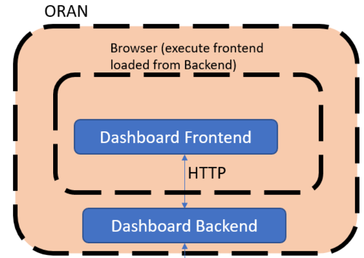

.. This work is licensed under a Creative Commons Attribution 4.0 International License.
.. SPDX-License-Identifier: CC-BY-4.0

..please write your project overview
..please delete this content after editing

Non-RT RIC Overview
===================

Find detailed description of what Non-RT RIC is on this `page`_.

.. _page: https://wiki.o-ran-sc.org/display/RICNR/

A-release architecture
----------------------

The architecture is as shown on the following picture:

The A1 controller is located in SDNC, an ONAP component. It communicates with ORAN via the A1 interface with the Near-RT RIC simulator.

On the other end, it is accessible via a dashboard, that allows to interact with policies. The dashboard itself is split into the backend and the frontend, and can be deployed following the instructions on the `human interfaces page`_.

.. _human interfaces page: ./human-interfaces.html

Requirements for the Non-RT RIC project
---------------------------------------

There are functional requirements emitted by O-RAN WG2 for the Non-RT RIC, which are the following:

1. Non-RT RIC shall support data retrieval and analysis; the data may include performance, configuration or other data related to the application (recommended data shown in required data section for  different use cases).
2. Non-RT RIC shall support relevant AI/ML model training based on the data in 1. for non-real-time optimization of configuration parameters in RAN or Near-RT RIC, as applicable for the use case.
3. Non-RT RIC shall support relevant AI/ML model training based on the data in 1. for generating/optimizing policies and intents to guide the behavior of applications in Near-RT RIC or RAN, as applicable for the use case.
4. Non-RT RIC shall support training of relevant AI/ML models based on the data in 1. to be deployed/updated in Near-RT RIC as required by the applications.
5. Non-RT RIC shall support performance monitoring and evaluation.
6. Non-RT RIC shall support a fallback mechanism to prevent drastic degradation/fluctuation of performance, e.g. to restore to the previous policy or configuration.

The non-functional requirements are the following ones:

1. Non-RT RIC shall not update the same policy or configuration parameter for a given near-RT RIC or RAN function more often than once per second.
2. Non-RT RIC shall be able to update policies in several near-RT RICs.

Moreover, there are functional requirements regarding the A1 interface:

1. A1 interface shall support communication of policies/intents from Non-RT RIC to Near-RT RIC.
2. A1 interface shall support AI/ML model deployment and update from Non-RT RIC to Near-RT RIC.
3. A1 interface shall support communication of enrichment information from Non-RT RIC to Near-RT RIC.
4. A1 interface shall support feedback from Near-RT RIC for monitoring AI/ML model performance.
5. A1 interface shall support the policy/intents feedback from Near-RT RIC to Non-RT RIC.

A1 policy procedure
-------------------

As for A-release, the methods are as follows:

+---------------------+--------------------------+--------------------------+
| A1 policy procedure | Single policy method     | Multiple policies method |
+---------------------+--------------------------+--------------------------+
| Create policy       | PUT                      |                          |
+---------------------+--------------------------+--------------------------+
| Query policy        | GET                      | GET (sequence of \*)     |
+---------------------+--------------------------+--------------------------+
| Update policy       | PUT                      |                          |
+---------------------+--------------------------+--------------------------+
| Delete policy       | DELETE                   |                          |
+---------------------+--------------------------+--------------------------+
| Notify policy       | POST                     | POST                     |
+---------------------+--------------------------+--------------------------+