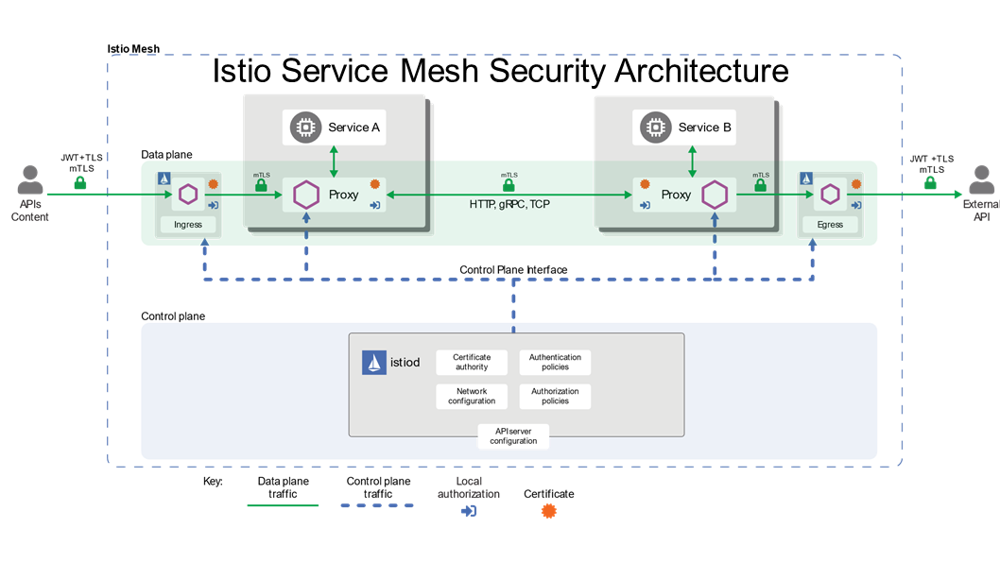
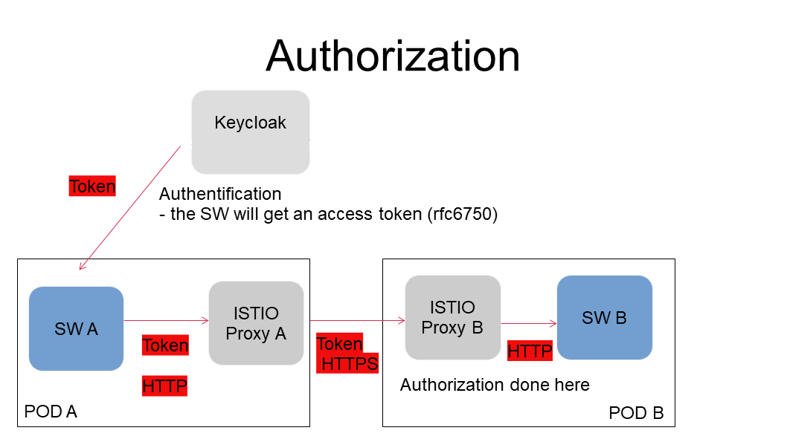
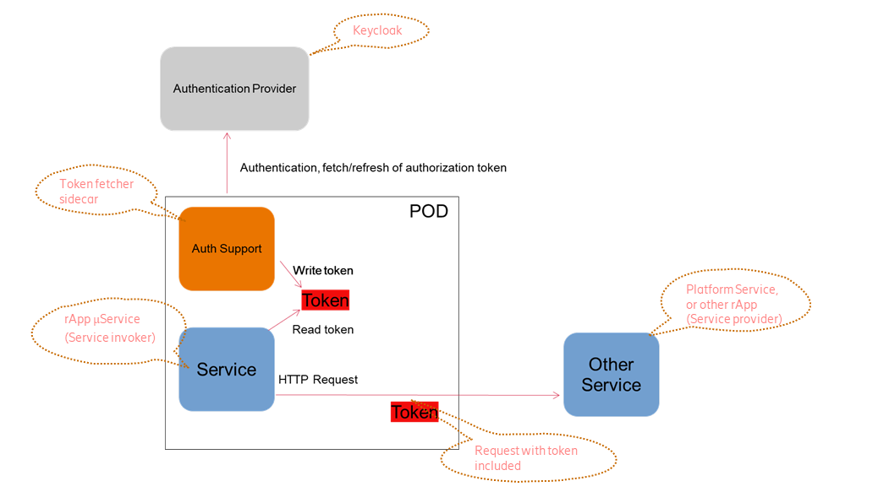
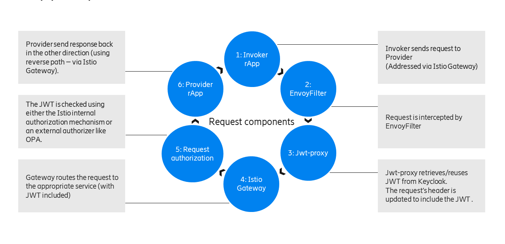
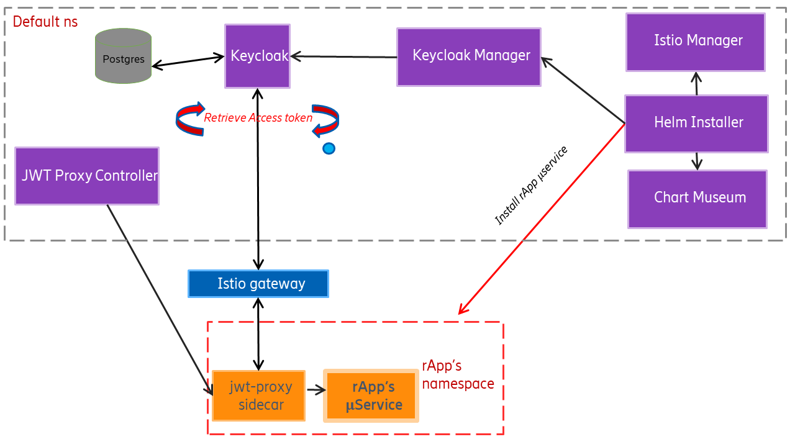
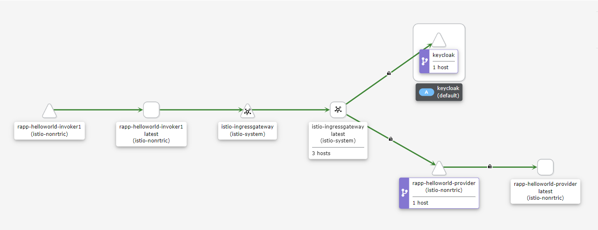

.. This work is licensed under a Creative Commons Attribution 4.0 International License.
.. SPDX-License-Identifier: CC-BY-4.0
.. Copyright (C) 2023 Nordix

#################################
Security Architecture Prototyping
#################################

************
Introduction
************
The O-RAN (Open Radio Access Network) security architecture is a framework for securing the communication between different
components of an open system. It is designed to ensure the confidentiality, integrity, and availability of data and services,
while also providing protection against potential security threats.
This involves securing the communication between different components, including encryption, authentication, and access control.
The O-RAN security architecture is designed to be flexible, scalable, and interoperable, enabling different vendors to integrate their solutions into the O-RAN ecosystem while maintaining security.

Here are some key features provided by the platform:

* MTLS provides secure encrypted communication and mutual authentication of peers.
* Users are authenticated using a client via the OpenID Connect (OIDC) protocol.
* OAuth 2.0 is a framework that controls authorization for access of services.

Apps (rApps) need to use Service Management & Orchestration (SMO) services and provide services to other Apps.
Apps & SMO services may be multivendor.
The goal of the Security Architecture is to provide selective & controlled exposure of these services.

* Ensure that services cannot be accessed without a valid token.
* Ensure that inter-services communication is done using mTLS.
* Ensure the automated setup and configuration of security prior to app deployment.

This product is a part of :doc:`NONRTRIC <../index>`.

**********
Components
**********

======
Istio
======
App security relies on Istio service mesh to enforce mTLS between applications.
The applications running in the cluster are not required to implement mTLS,
instead this is done by attaching an Istio sidecar to the running containers.
mTLS communication is done between the sidecars.

========
Keycloak
========
Keycloak is an open-source identity and access management tool.
It is used to issue access tokens to the apps.
The access token comes in the form of a JWT which includes claims or fields which are used to determine the access level to grant to a particular app.

 * Access tokens (JWT) are retrieved using Keycloak clients.
 * Access token has limited lifetime (needs to be refreshed).
 * Access token is sent in the HTTP header is each REST call.

This is an example of a JWT payload:

.. code-block:: javascript

   {
      "exp": 1683628065,
      "iat": 1683627765,
      "jti": "b61ae49d-5a73-4e91-96f2-de3b400a5779",
      "iss": "https://keycloak:8443/realms/demo",
      "sub": "e7709f80-61bd-4440-a265-d51c4fed8ece",
      "typ": "Bearer",
      "azp": "demoprovider-cli",
      "session_state": "89ac7390-2865-4e07-bd1a-aea43c43827a",
      "scope": "email",
      "sid": "89ac7390-2865-4e07-bd1a-aea43c43827a",
      "clientHost": "127.0.0.6",
      "clientId": "demoprovider-cli",
      "email_verified": false,
      "clientRole": [
         "provider-viewer"
      ],
      "clientAddress": "127.0.0.6"
   }

========
Postgres
========
Postgres is used as the back-end database for Keycloak, it will persistent the Keycloak objects that have been created.

============
Cert Manager
============
Cert Manager is used to provide both server and client certificates for Keycloak.
It also provides certificates for the webhook server.

============
Chart Museum
============
Chart museum is used to  stores the Helm charts for the apps.

==============
Helm Installer
==============
Helm installer is used to automate the installation of the Helm charts.
Each chart contains an app configuration section in the values.yaml file which is used by Istio manager and Keycloak manager.

==============
Istio Manager
==============
Istio manager is used to automate the setup of Gateways, Virtual Services, Authorization Policies
and Request Authentication polices for the apps.
The exact configuration required is read from the values.yaml file in the Helm chart.

================
Keycloak Manager
================
Keycloak manager is used to automate the setup of realms, clients, users, role mappings and authentication flows.
Keycloak provides REST API endpoints for creating and deleting these objects.
The exact configuration required is read from the values.yaml file in the Helm chart.

====================
JWT Proxy Controller
====================
The Jwt Proxy Admission Controller determines whether to attach a jwt proxy sidecar to the app container based on the app label.
If permitted the exact configuration required is read from the values.yaml file in the Helm chart.

************
Request Flow
************

============
Provider App
============
When a provider app is installed using Helm manager, all the necessary security is automatically setup prior to deployment.

Helm manager calls Istio manager and sets up the following Istio services:
 * Gateway: a load balancer operating at the edge of the mesh receiving incoming or outgoing HTTP/TCP connections.
 * VirtualService: routes request from the gateway to the app.
 * RequestAuthentication: verifies the issuer and jwksUri of the JWT.
 * AuthorizationPolicy: authorizes incoming requests based on claims in the JWT.

Helm manager calls Keycloak manager and sets up the following Keycloak objects:
 * Realm : represents a set of users, credentials, roles, groups and clients. Realms can be used to isolated different apps from each other.
 * Client: used to authenticate a user and retrieve a JWT.
 * Role Mapper: maps the user role(s) to the token. These role(s) are used during app authorization.

Clients support 4 authenticator types:
 #. Client Secret
 #. x509 certificate
 #. JWT signed with certificate
 #. JWT signed with secret

Depending on the app configuration it will either setup an x509 client, a jwt client or a secret client.

.. note:: If the app is configured to use the x509 authenticator, a direct flow grant for x509 is also setup to check fields in x509 certificate against some pre-defined value(s).

===========
Invoker App
===========
When an invoker app is installed using Helm manager,
the app label is used to determine whether to inject the deployment with a jwt proxy sidecar.
If the app label has been whitelisted the proxy is added to the container.
The jwt proxy sidecar will automatically retrieve the token required to access the app provider and include it in the request header.

This is an example of a provider and invoker running in a cluster:

.. note:: Security for service registry and management using the 3GPP Common API framework is available here:
     :doc:`Service Management & Exposure (SME) documentation site <sme:index>`.
