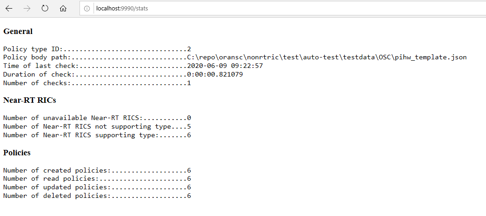

.. This work is licensed under a Creative Commons Attribution 4.0 International License.
.. http://creativecommons.org/licenses/by/4.0
.. Copyright (C) 2020 Nordix

Use Cases
=========

To support the use cases defined for the Non-RT RIC, there are implementations provided in the nonrtric repo, see:
  nonrtric/test/usecases

Health Check
------------
The Health Check use case for the Non-RT RIC is a python script that regularly creates, reads, updates, and deletes a
policy in all Near-RT RICs that support the type used by the script. A self refreshing web page provides a view of
statistics for these regular checks.

For more information about it, see the README file in the use case's folder.

O-RU closed loop recovery
-------------------------
Non-RT RIC provides two implementation versions of the recovery part of the use case. One in the form of a python
script, and one utilizing the Policy Framework.

Script version
++++++++++++++
The script version consists of a python script that performs the tasks needed for the use case. There are also two
simulators. One message generator that generates alarm messages, and one SDN-R simulator that recieves the config
change messages sent from the script and responds with alarm cleared messages to MR.

All parts are Dockerized and can be started as individual containers, in the same network, in Docker.
